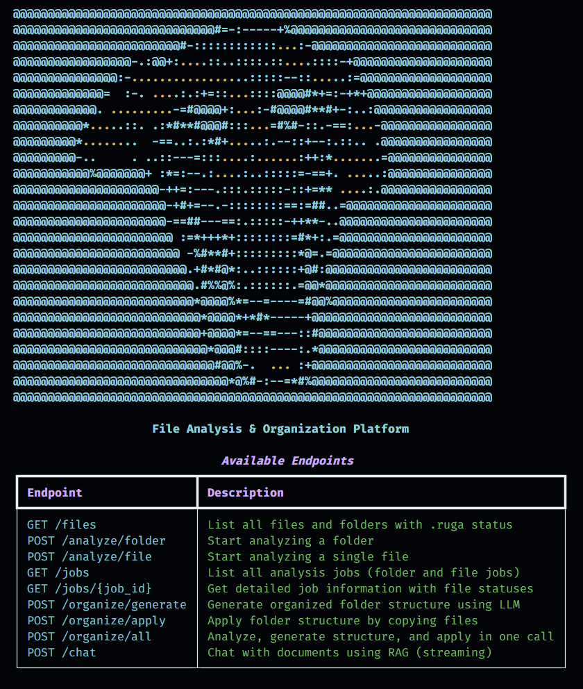
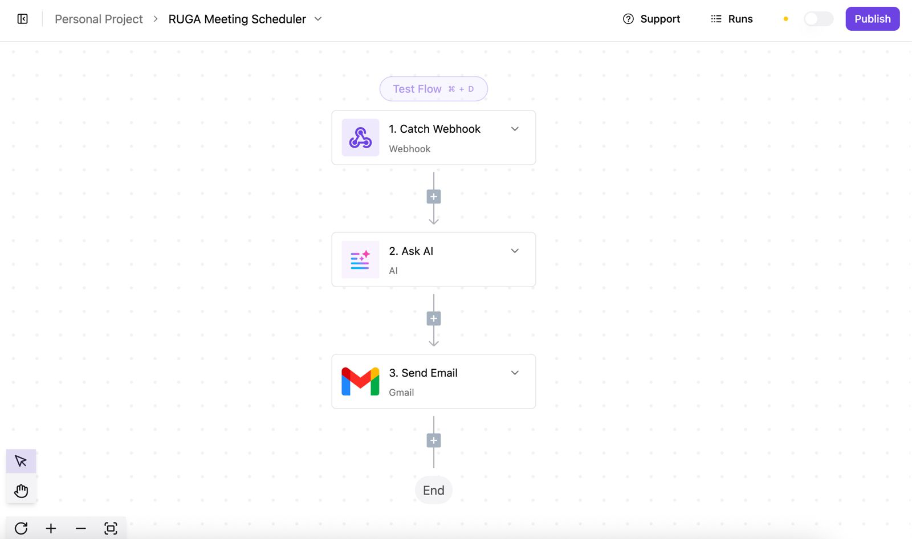

# RUGA

**RUGA** (Ruga File Analysis & Organization Platform) is an intelligent file management system that uses Large Language Models (LLMs) to analyze, organize, and chat with your documents. RUGA creates `.ruga` metadata files for each document, enabling powerful search, organization, and retrieval capabilities.



## What RUGA Does

RUGA provides three main capabilities:

1. **File Analysis**: Automatically analyzes files (PDFs, documents, text files) using LLMs to extract metadata including:
   - Titles, summaries, and topics
   - Categories and tags
   - Authors and dates
   - Suggested filenames
   - All stored in `.ruga` metadata files

2. **Intelligent Organization**: Uses LLM-powered structured output to suggest and apply organized folder structures based on:
   - Document categories (Education, Research, Seminars, etc.)
   - Academic years and dates
   - Topics and tags
   - Content analysis

3. **Document Chat (RAG)**: Chat with your documents using Retrieval-Augmented Generation (RAG):
   - Semantic search across all documents
   - Filter by category, topic, or tag
   - Ask questions and get answers based on your document content
   - Streaming responses for real-time interaction

## Features

- ✅ **Automatic File Analysis**: Generate rich metadata for PDFs, documents, and text files
- ✅ **LLM-Powered Organization**: Intelligent folder structure suggestions
- ✅ **Vector Store Search**: Embed documents for semantic search and retrieval
- ✅ **RAG Chat Interface**: Ask questions about your documents
- ✅ **Background Processing**: Asynchronous file analysis with job tracking
- ✅ **Web Interface**: Modern SvelteKit frontend with real-time progress tracking
- ✅ **Beautiful CLI**: Command-line interface with ASCII art and rich formatting
- ✅ **RESTful API**: Full API for integration with other tools
- ✅ **Multiple LLM Providers**: Support for Gemini (free tier), OpenAI, and GreenPT

## Installation

### Prerequisites

- Python 3.11 or higher
- LLM API key (Gemini, OpenAI, or GreenPT)
- [uv](https://github.com/astral-sh/uv) (recommended) or pip

### Setup

1. **Clone the repository:**
   ```bash
   git clone <repository-url>
   cd RugaTeam
   ```

2. **Install dependencies:**
   ```bash
   # Using uv (recommended)
   uv sync
   
   # Or using pip
   pip install -e .
   ```

3. **Configure environment variables:**
   ```bash
   # Copy the example file
   cp .env.example .env

   # Edit .env and configure your LLM provider
   # Default is Gemini (free tier available)
   LLM_PROVIDER=gemini
   GOOGLE_API_KEY="your-google-api-key-here"

   # Or use OpenAI
   # LLM_PROVIDER=openai
   # OPENAI_API_KEY="your-openai-api-key-here"
   ```

## Quick Start

### 1. Start the Backend Server

```bash
# From the project root
cd backend
python main.py

# Or using uvicorn directly
uvicorn backend.main:app --reload --host 0.0.0.0 --port 8000
```

The backend API will be available at `http://localhost:8000`

### 2. Start the Web Frontend (Optional)

```bash
# In a new terminal
cd frontend
npm install
cp .example.env .env
npm run dev
```

The web interface will be available at `http://localhost:5173`

### 3. Use the CLI (Alternative to Web UI)

```bash
# Check server connection
ruga info
# or
python -m ruga_cli info

# List files in a directory
ruga files list ./examples/unstructured_folder

# Analyze a folder
ruga analyze folder ./examples/unstructured_folder

# Check job status
ruga jobs list

# Organize folder (analyze + generate + apply)
ruga organize all ./examples/unstructured_folder

# Chat with documents
ruga chat "What documents discuss survival analysis?"
```

## Web Frontend

RUGA includes a modern web interface built with SvelteKit, providing a user-friendly alternative to the CLI.

### Features

- **List Files**: View all files in a directory with their `.ruga` analysis status
- **Analyze All**: Analyze files with real-time progress tracking (shows per-file status)
- **Organize**: Two-step organization flow - preview suggested structure, then apply
- **Chat**: RAG-powered chat with your documents using streaming responses
- **Smart Button States**: Buttons automatically disable when actions aren't applicable (e.g., "Already Organized" for organized folders)

### Running the Frontend

```bash
cd frontend
npm install
cp .example.env .env
npm run dev
```

Open `http://localhost:5173` in your browser.

### Frontend Configuration

The frontend connects to the backend via the `.env` file:

```env
VITE_API_BASE_URL=http://localhost:5173/api
API_RUGA_SERVER=http://localhost:8000
```

### Using the Web Interface

1. **Enter a folder path** in the input field (e.g., `D:\Documents\Research`)
2. **Click "List Files"** to see all files and their analysis status
3. **Click "Analyze All (N)"** to analyze files without `.ruga` metadata
   - Watch real-time progress with per-file status updates
4. **Click "Organize (N)"** to organize analyzed files
   - Preview the suggested folder structure
   - Review file moves with reasons
   - Click "Apply" to create the organized folder
5. **Use the Chat** panel to ask questions about your documents

### Technology Stack (Frontend)

- **SvelteKit 2**: Modern web framework with SSR
- **Svelte 5**: Latest Svelte with Runes reactivity
- **TailwindCSS 4**: Utility-first styling
- **TanStack Table**: Headless table for file listing

## RUGA CLI

The RUGA CLI is an alternative interface for interacting with the RUGA server. It provides a beautiful command-line experience with ASCII art banners and rich formatting.

### Installation

The CLI is included with the RUGA server package. After installing dependencies, the `ruga` command will be available:

```bash
# Verify installation
python -m ruga_cli --help
# or if installed with entry point
ruga --help
```

### Configuration

The CLI connects to the RUGA server. By default, it connects to `http://localhost:8000`.

**Set server URL via environment variable:**
```bash
export RUGA_SERVER_URL="http://localhost:8000"
```

**Or use command-line option:**
```bash
ruga --server-url http://localhost:8000 <command>
```

### CLI Commands

#### Show API Information
```bash
ruga info
```
Displays server information, connection status, and available endpoints with a beautiful ASCII art banner.

#### File Operations
```bash
# List all files with .ruga status
ruga files list /path/to/directory
```

#### Analysis Operations
```bash
# Analyze entire folder
ruga analyze folder /path/to/folder

# Analyze single file
ruga analyze file /path/to/file.pdf
ruga analyze file /path/to/file.pdf --root-path /path/to/root
```

#### Job Management
```bash
# List all jobs
ruga jobs list
ruga jobs list --include-file-statuses  # Include individual file statuses

# Get job details
ruga jobs get <job_id>
```

#### Folder Organization
```bash
# Generate folder structure suggestion
ruga organize generate /path/to/folder

# Apply folder structure
ruga organize apply <structure_id>
ruga organize apply <structure_id> --dry-run  # Preview without copying

# Complete workflow (analyze + generate + apply)
ruga organize all /path/to/folder
ruga organize all /path/to/folder --no-wait  # Don't wait for analysis
ruga organize all /path/to/folder --max-wait-seconds 600  # Wait up to 10 minutes
```

#### Chat with Documents
```bash
# Chat with documents using RAG
ruga chat "What documents discuss survival analysis?"

# Chat with conversation history
ruga chat "Tell me more" --history history.json
```

### Complete Workflow Example

```bash
# 1. List files to see what needs analysis
ruga files list ./examples/unstructured_folder

# 2. Analyze the folder
ruga analyze folder ./examples/unstructured_folder

# 3. Check job status
ruga jobs list
ruga jobs get <job_id>

# 4. Generate folder structure
ruga organize generate ./examples/unstructured_folder

# 5. Apply the structure
ruga organize apply <structure_id>

# 6. Or do it all at once
ruga organize all ./examples/unstructured_folder

# 7. Chat with your documents
ruga chat "What are the main topics in my documents?"
ruga chat "Find documents about causal inference"
```

## Server API

The RUGA server provides a RESTful API for programmatic access. When the server is running, interactive API documentation is available at:
- **Swagger UI**: `http://localhost:8000/docs`
- **ReDoc**: `http://localhost:8000/redoc`

### Key Endpoints

- `GET /` - API information
- `GET /files?root_path=<path>` - List files with .ruga status
- `POST /analyze/folder` - Start folder analysis
- `POST /analyze/file` - Start single file analysis
- `GET /jobs` - List all analysis jobs
- `GET /jobs/{job_id}` - Get job details
- `POST /organize/generate` - Generate folder structure
- `POST /organize/apply` - Apply folder structure
- `POST /organize/all` - Complete organization workflow
- `POST /chat` - Chat with documents (streaming)

See [backend/README.md](backend/README.md) for complete API documentation.

## How It Works

### 1. File Analysis

When you analyze a file, RUGA:
1. Extracts text content using Docling (for PDFs, DOCX) or direct reading (for text files)
2. Uses an LLM to analyze the content and extract metadata
3. Creates a `.ruga` file alongside the original file containing:
   - Title, summary, and topics
   - Categories and tags
   - Authors and dates
   - Suggested filename
   - File ID and metadata

### 2. Vector Store

Analyzed documents are automatically:
1. Split into chunks for better retrieval
2. Embedded using OpenAI embeddings
3. Stored in ChromaDB vector store
4. Indexed with metadata (categories, topics, tags) for filtering

### 3. Folder Organization

The organization process:
1. Collects all `.ruga` metadata files
2. Uses LLM with structured output to analyze patterns
3. Suggests folder structure based on categories, dates, topics
4. Creates new organized folder with UUID prefix
5. Copies files to new locations (preserving originals)
6. Updates vector store with new paths

### 4. RAG Chat

The chat interface:
1. Uses vector store to retrieve relevant document chunks
2. Filters by category, topic, or tag when specified
3. Provides context to LLM for answering questions
4. Streams responses in real-time

## Project Structure

```
RugaTeam/
├── backend/              # FastAPI server
│   ├── main.py          # Server entry point
│   ├── models/           # Pydantic schemas
│   └── services/         # Business logic
│       ├── analysis_service.py
│       ├── chat_service.py
│       ├── file_service.py
│       ├── folder_organization_service.py
│       ├── job_service.py
│       └── vector_store_service.py
├── frontend/             # SvelteKit web interface
│   ├── src/
│   │   ├── routes/       # Pages and API routes
│   │   │   ├── +page.svelte        # Main page
│   │   │   └── api/                # Backend proxy routes
│   │   └── lib/
│   │       ├── components/         # UI components
│   │       │   ├── analysis/       # Analysis progress
│   │       │   ├── chat/           # Chat interface
│   │       │   ├── documents/      # File table
│   │       │   └── organize/       # Organization preview/result
│   │       └── types/              # TypeScript types
│   └── .env              # Frontend configuration
├── ruga_cli/             # Command-line interface
│   ├── cli.py            # CLI commands
│   ├── api_client.py     # API client wrapper
│   └── README.md         # CLI documentation
├── examples/             # Example files and scripts
│   └── unstructured_folder/  # Sample folder for testing
├── assets/               # Images and resources
├── chroma_db/            # Vector store database (created automatically)
└── pyproject.toml        # Project configuration
```

## GreenPT Integration

RUGA supports [GreenPT](https://docs.greenpt.ai/), an alternative LLM provider. Enable it by setting `GREENPT_ENABLED=true` and `GREENPT_API_KEY` in your `.env` file.

**Models:**
- LLM: `mistral-small-3.2-24b-instruct-2506` (for chat and folder organization)
- Embeddings: `green-embedding` (for vector store)

If disabled, RUGA uses OpenAI by default (`gpt-4o-mini` for LLM, `text-embedding-3-small` for embeddings).

## ActivePieces Integration

RUGA integrates with [ActivePieces](https://www.activepieces.com), a workflow automation platform and hackathon sponsor. Create automated workflows that are triggered by RUGA's `/chat` endpoint via webhooks.



### Example Workflow

We've created a workflow that:
1. Receives a report from RUGA's `/chat` endpoint via webhook
2. Formats the report as an email using an LLM
3. Sends the email to different people/groups automatically

### Setup

1. Create a workflow in ActivePieces with a webhook trigger
2. Configure the AI agent in RUGA's `/chat` endpoint to call the ActivePieces webhook URL
3. When chat generates a report, it automatically triggers the workflow

**Resources:** [ActivePieces Docs](https://www.activepieces.com/docs) | [Webhook Guide](https://www.activepieces.com/docs/triggers/webhook)

## Troubleshooting

### CLI Issues

**"Connection refused" or "Cannot connect":**
- Make sure the server is running: `cd backend && python main.py`
- Check the server URL: `ruga info --server-url http://localhost:8000`

**"Command not found: ruga":**
- Install in editable mode: `pip install -e .` or `uv sync`
- Or use: `python -m ruga_cli` instead of `ruga`

**Import errors:**
- Make sure all dependencies are installed: `uv sync`
- Check Python version: `python --version` (requires >= 3.11)

### Server Issues

**Analysis not working:**
- Verify `OPENAI_API_KEY` is set in `.env` file (or `GREENPT_API_KEY` if using GreenPT)
- If using GreenPT, ensure `GREENPT_ENABLED=true` is set
- Check server logs for error messages
- Ensure files are readable and in supported formats

**Vector store errors:**
- The `chroma_db/` directory is created automatically
- If issues persist, delete `chroma_db/` and restart the server

**Job not found:**
- Jobs are stored in memory, so restarting the server clears job history
- Use `ruga jobs list` to see available jobs

## Development

### Running in Development Mode

```bash
# Terminal 1: Start backend with auto-reload
uvicorn backend.main:app --reload --host 0.0.0.0 --port 8000

# Terminal 2: Start frontend with hot reload
cd frontend && npm run dev
```

### Technology Stack

**Backend:**
- **FastAPI**: Web framework for the API server
- **LangChain/LangGraph**: LLM integration and RAG agents
- **ChromaDB**: Vector store for document embeddings
- **Docling**: Document parsing (PDF, DOCX)
- **Pydantic**: Data validation

**Frontend:**
- **SvelteKit 2**: Web framework with SSR
- **Svelte 5**: UI framework with Runes reactivity
- **TailwindCSS 4**: Utility-first CSS
- **TanStack Table**: Headless table library

**LLM Providers:**
- **Gemini**: Default provider (free tier available)
- **OpenAI**: GPT models and embeddings
- **GreenPT**: Alternative provider

**CLI:**
- **Click**: CLI framework
- **Rich**: Terminal formatting and ASCII art

### Environment Variables

Required:
- `OPENAI_API_KEY`: Your OpenAI API key for file analysis and chat (or use GreenPT)

Optional:
- `RUGA_SERVER_URL`: Server URL for CLI (default: `http://localhost:8000`)
- `GREENPT_ENABLED`: Set to `true` to use GreenPT instead of OpenAI (default: `false`)
- `GREENPT_API_KEY`: Your GreenPT API key (required if `GREENPT_ENABLED=true`)

## License

See [LICENSE](LICENSE) file for details.

## Contributing

This project was created for Fixathon 13/12/2025. Contributions and improvements are welcome!

## Support

For issues, questions, or contributions, please open an issue on the repository.

---

**RUGA** - Intelligent file analysis and organization powered by LLMs 🚀

*Built for Fixathon 13/12/2025 | Sponsored by ActivePieces*
