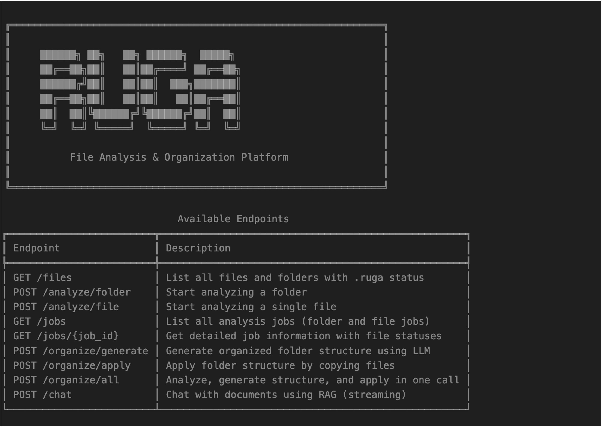

# RUGA CLI

Command-line interface for the RUGA server API.



*Screenshot of the RUGA CLI showing the ASCII art banner and server information*

## Installation

The CLI is included with the RUGA server package. After installing the project dependencies, the `ruga` command will be available.

```bash
# Install dependencies (if using uv)
uv sync

# Or with pip
pip install -e .
```

## Configuration

The CLI connects to the RUGA server. By default, it connects to `http://localhost:8000`.

You can configure the server URL in two ways:

1. **Environment variable:**
   ```bash
   export RUGA_SERVER_URL="http://localhost:8000"
   ```

2. **Command-line option:**
   ```bash
   ruga --server-url http://localhost:8000 <command>
   ```

## Usage

### Show API Information

```bash
ruga info
```

### File Operations

**List files in a directory:**
```bash
ruga files list /path/to/directory
```

### Analysis Operations

**Analyze a folder:**
```bash
ruga analyze folder /path/to/folder
```

**Analyze a single file:**
```bash
ruga analyze file /path/to/file.pdf
ruga analyze file /path/to/file.pdf --root-path /path/to/root
```

### Job Management

**List all jobs:**
```bash
ruga jobs list
ruga jobs list --include-file-statuses  # Include individual file statuses
```

**Get job details:**
```bash
ruga jobs get <job_id>
```

### Folder Organization

**Generate folder structure:**
```bash
ruga organize generate /path/to/folder
```

**Apply folder structure:**
```bash
ruga organize apply <structure_id>
ruga organize apply <structure_id> --dry-run  # Preview without copying
```

**Organize all (analyze + generate + apply):**
```bash
ruga organize all /path/to/folder
ruga organize all /path/to/folder --no-wait  # Don't wait for analysis
ruga organize all /path/to/folder --max-wait-seconds 600  # Wait up to 10 minutes
```

### Chat with Documents

**Chat with documents using RAG:**
```bash
ruga chat "What documents discuss survival analysis?"
```

**Chat with conversation history:**
```bash
# Create a history.json file:
# {
#   "messages": [
#     {"role": "user", "content": "Hello"},
#     {"role": "assistant", "content": "Hi! How can I help?"}
#   ]
# }
ruga chat "Tell me more" --history history.json
```

## Examples

### Complete Workflow

1. **List files to see what needs analysis:**
   ```bash
   ruga files list ./examples/unstructured_folder
   ```

2. **Analyze the folder:**
   ```bash
   ruga analyze folder ./examples/unstructured_folder
   ```

3. **Check job status:**
   ```bash
   ruga jobs list
   ruga jobs get <job_id>
   ```

4. **Generate folder structure:**
   ```bash
   ruga organize generate ./examples/unstructured_folder
   ```

5. **Apply the structure:**
   ```bash
   ruga organize apply <structure_id>
   ```

6. **Or do it all at once:**
   ```bash
   ruga organize all ./examples/unstructured_folder
   ```

7. **Chat with your documents:**
   ```bash
   ruga chat "What are the main topics in my documents?"
   ruga chat "Find documents about causal inference"
   ```

## Command Reference

```
ruga [OPTIONS] COMMAND [ARGS]...

Options:
  --server-url TEXT  RUGA server URL (default: http://localhost:8000)

Commands:
  info              Show API information and available endpoints
  files             File operations
  analyze           Analysis operations
  jobs              Job management operations
  organize          Folder organization operations
  chat              Chat with documents using RAG
```

## Troubleshooting

**Connection refused:**
- Make sure the RUGA server is running on the configured port
- Check the server URL with `ruga info`

**Import errors:**
- Make sure all dependencies are installed: `uv sync` or `pip install -e .`
- Verify the package is installed in editable mode if developing

**Job not found:**
- Jobs are stored in memory on the server, so restarting the server will clear job history
- Use `ruga jobs list` to see available jobs
